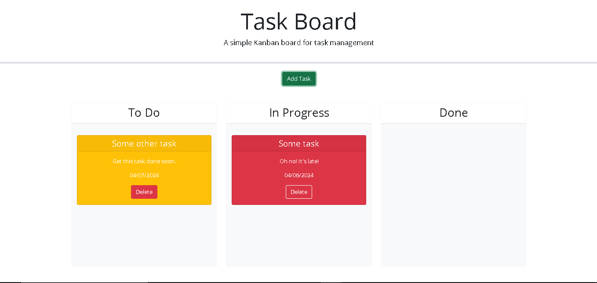

# Task Board

## Description
This is a simple task board that helps the user stay on top of tasks. Never miss a deadline, and stay on top of tasks with Task Board!
## Installation
The Task Board app can be found at this link:
 [Task Board](https://jfleming963.github.io/Task-Board/).

## Usage
In this app, the user can create tasks and sort them by urgency. Task cards are color coded based on beine past due, due today, or due in the future. User can drag and drop cards into lanes to sort them by categories of: to do, in progress, or done.
## Credits
n/a
## License 

Please refer to the LICENSE in the repo.

